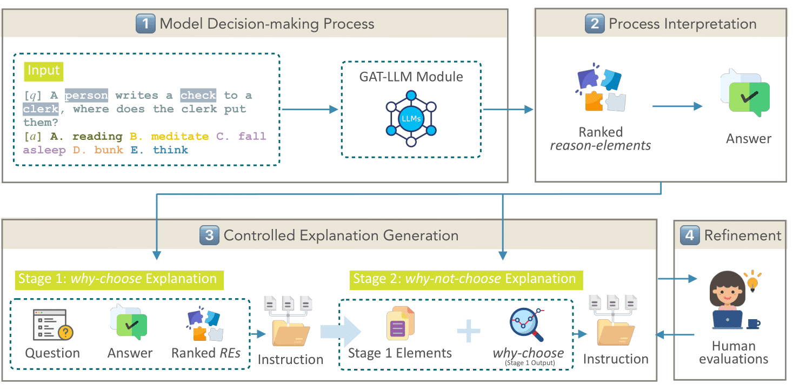

# XplainLLM Documentation


Ever wondered about what language models are "thinking about" under the hood? Eager to probe into the essential components that underlie their decisions? Enter XplainLLM, a dataset that offers insights into the decision-making processes of large language models (LLMs) through natural-language explanations. XplainLLM is designed to foster transparency, trust, and a comprehension of LLM behaviors, and will benefit researchers, data scientists, and anyone enthusatistic about AI.

### Main Characteristics of XplainLLM

- **Bridging the Gap with Natural Language**: To the best of our knowledge, XplainLLM is the first dataset to capture the most influential elements behind the model reasoning and present the decision-making process through human-understandable explanations. Our dataset even enables  general users to easily comprehend the model's decision-making process, paving the way towards solidifying trust between the model and its users.
- **Comprehensive Understanding of Model Reasoning**: XplainLLM incorporates reason-elements from knowledge graphs (KGs), top-ranked reason-elements, explanations for chosen answers, and explanations of why other options weren't selected. The goal is to empower the community to delve deeper into the decision-making dynamics of LLMs. This work contributes to enhancing the knowledge and the transparency of model reasoning.
- **Human-Centric Explanations**: We make auto-generated explanations more human-understandable by introducing an "explainer" LLM to organize the decision-influencing elements into coherent natural language sentences. We evaluate the quality of our explanations through both algorithmic and human evaluations, and the results underscore our dataset's quality on multiple metrics.
- **User-Friendly Design**: We provide a unified schema, detailed textual guidelines, and detailed usage instructions to help users swiftly adapt to and utilize our dataset for diverse purposes.
- **Refined by Human Review**: Generated explanations undergo human review and refinement to ensure high quality of our dataset.

## Contents

- [XplainLLM Documentation](#xplainllm-documentation)
    - [Main Characteristics of XplainLLM](#main-characteristics-of-xplainllm)
  - [Contents](#contents)
  - [Dataset Description](#dataset-description)
    - [Schema](#schema)
    - [Data Format](#data-format)
    - [Example](#example)
  - [Explanation Generation Framework](#explanation-generation-framework)
  - [Key Features](#key-features)
  - [Usage Instructions](#usage-instructions)
  - [Comparison](#comparison)
  - [Potential Applications](#potential-applications)
  - [To-Do List](#to-do-list)
  - [Contact](#contact)

## Dataset Description


XplainLLM offers comprehensive insight into the decisions made by large language models during their response generation process. The dataset includes commonsense questions,  potential answer choices, the selected answer by an LLM, the *reason-elements* used during decision-making by the LLM, an explanation of the reasoning behind the selection, and an explanation of why other answers were not chosen.

### Schema

- **Question**: The commonsense query posed to the model.
- **Answers**: A list of potential answers the model could choose from.
- **Label**: The correct or most appropriate answer from the list of potential answers (ground truth).
- **Predicted_Label**: The index of the answer the model believes to be the most accurate.
- **Label_Matched**: Indicates whether the model's chosen answer matches the **Label**.
- **Concept**: A list of *reason-elements* derived from the knowledge graph, illustrating the model's associations with the question and illuminating its decision-making process.
- **Topk**: The top 5 *reason-elements* that are the primary influencers on the model's decision and form the basis of the generated explanation.
- **Explanation_Why**: A descriptive rationale elucidating why the model chose a particular answer.
- **Explanation_Why_Not**: A detailed account of why the model did not choose the other answers.

### Data Format

The complete dataset can be found in the file named `xplainllm.jsonl`, which contains one json object in each line. The format of the json object is as follows

```
{
	"question": typeof(string),
	"answers": typeoof(list_of_strings),
	"label": typeof(string),
	"predicted_label": typeof(string),
	"label_matched": typeof(boolean),
	"concept": typeoof(list_of_strings),
	"topk": typeoof(list_of_strings),
	"explanation_why": typeof(string),
	"explanation_why_not": typeof(string)
}

```

We split the dataset into three files for convenience: `train.jsonl`, `dev.jsonl`, and `test.jsonl`. In `test.jsonl` we do not have the ground truth labels for the correct answers.

### Example

The following is an example instance from our **XplainLLM**  dataset:

```
{
	"question": "The people danced to the music, what was the music like for them?",
	"answers": ["soothing","vocal or instrumental","loud","universal","enjoyable"],
	"label": "enjoyable",
	"predicted_label": "4",
	"label_matched": true,
	"concept": ["play_mozart","listening_to_classical_music","together","abnd","dancefest","irritation", ...],
	"topk": ["play_mozart","listening_to_classical_music","together","abnd","dancefest"],
	"explanation_why": "Since the words "play_mozart" and "listening_to_classical_music" suggest that the music was likely of high quality and enjoyable to listen to, and since the words "together" and "dancefest" suggest that the people were likely in a social and festive setting, the model predicts that the music was enjoyable for them. Therefore, the predicted option is "enjoyable".",
	"explanation_why_not": 	"The other potential choices can be combined into three categories: 1) "soothing" and "vocal or instrumental" do not match with the festive and social setting suggested by the words "together" and "dancefest"; 2) "loud" is not necessarily correlated with enjoyment and could be unpleasant for some people; 3) "universal" does not give any indication of the quality or character of the music, and is therefore too vague to be a valid choice."
}

```

## Explanation Generation Framework



1️⃣ Knowledge Retrieval and Key-Element Extraction: Given a question, we retrieve its relevant knowledge using the KG. The Decision LLM then extracts key-elements related to the question. These elements are forwarded to a specialized GAT-LLM module (known formally as Element-Graph Interpretation). Using GAT, we obtain the essential representations for interpretation by the model.

2️⃣ The model's decision-making is interpreted through the ranked reason-elements and the predicted answer.

3️⃣ A controllable dual-stage process generates the explanations:

- Stage 1: The initial phase focuses on generating the "why-choose" explanations.
- Stage 2: Building upon the outputs and elements of Stage 1, we then generate the "why-not-choose" explanations.

4️⃣ We conduct a human evaluation to identify errors in the explanations. If discrepancies arise, explanations are reverted to Step 3 for refinement. This process not only helps prevent potential issues arising from bad explanations generated by the LLM but also maintains human-aligned clarity and relevance.

## Key Features

💡 **Unlocking the Black Box**: Our dataset introduces a way to dive deep into understanding the decision-making of language models, transforming a black box into understandable insights.

⚙️ **Beyond Just 'What**: Our dataset doesn't just show 'what' — it emphasizes the 'why' and 'why not', pioneering a new paradigm of transparent AI explainability.

🧩 **Knowledge Graph-Driven Insights**: Our dataset integrates KGs, spotlighting decision-making clues derived from the reason elements. This helps provide a unique perspective on model behavior.

🎯 **Pioneering Transparency with XplainLLM**: XplainLLM introduces a novel framework that associates LM behavior with KGs. We offer a new approach to constrain and explain model behavior, which is a new way for the community to further understand LM decision-making.

💎 **Empower Research**: Whether you are debugging a model, evaluating its performance, designing human-AI interactions, or delving into research, our dataset is designed to help deepen the understanding and impact of XAI.

## Usage Instructions

1. **Downloading**:
- Access the dataset here: `official_dataset/`
- Download the `.jsonl` files (`xplainllm.jsonl`, `train.jsonl`, `dev.jsonl`, `test.jsonl`).
1. **Importing**:
- The dataset is available in a JSONL format. Use suitable data analysis tools or libraries to read and process the dataset, e.g.,
    
    ```
    import json
    data = []
    # Load the data file
    with open('path_to_data.jsonl', 'r') as file:
       for line in file:
       	data.append(json.loads(line))
    ```
    
1. **Navigating**:
- Each entry corresponds to a question-answer-explanation triple.
- Navigate through the various keys like 'Question', 'Answers', 'Explanation_Why', etc., to understand each component, e.g.,
    
    ```
    # Read question
    question = data["question"]
    ```
    
    ```
    # Read answers list
    answers_lsit = data["answers"]
    ```
    
    ```
    # Read predicted answer
    predicted_answer = answers_lsit[int(data["predicted_label"])]
    ```
    
    ```
    # Read top reasoning-elements
    top_elements = data["topk"]
    ```
    
    ```
    # Read reasoning-elements
    reasoning_elements = data["concept"]
    ```
    
    ```
    # Read whether predicted answer is correct
    correct_or_not = data["label_matched"]
    ```
    
    ```
    # Read explanation for why model choose a particular answer
    explanation_why = data["explanation_why"]
    ```
    
    ```
    # Read explanation for why model does not choose other answer
    explanation_why_not = data["explanation_why_not"]
    ```
    

## Comparison

| Dataset | Size | Answer Format | Expl. Format | Source | Model Match? | Self-Explanatory? | "Why Not" Included? |
| --- | --- | --- | --- | --- | --- | --- | --- |
| CoS-E | 9,500 | MCQ | NL | Human | ❌ | ❌ | ❌ |
| ECQA | 10,962 | MCQ | NL | Human | ❌ | ✅ | ❌ |
| Neuron | 307,200 | Neuron | NL + Score | Model | ✅ | ❌ | ❌ |
| **XplainLLM** | 12,247 | MCQ | NL | Model | ✅ | ✅ | ✅ |

**[Datasets]**

- CoS-E: A dataset that consists of human explanations for commonsense
reasoning.
- ECQA: A dataset that consists of human explanations for
commonsense reasoning, including positive and negative facts.
- Neuron: A dataset that consists of explanations for the behavior of
neurons in GPT-2.

**[Terms]**

- Size: Number of entries in the dataset.
- Answer Format: The type of answers, such as multiple-choice (MCQ).
- Explanation Format: The type of explanation, such as natural language (NL).
- Source: Where the explanation originates from.
- Model Match?: Indicates if the explanation aligns with the model's decision-making process.
- Self-Explanatory?: Indicates if human intervention is needed to deduce the reasoning.
- "Why Not" Included?: Specifies if the dataset provides reasons for not choosing other answers.

## Potential Applications

1. **Model Debugging**: Understand and rectify areas where the model's reasoning might seem ambiguous or inconsistent.
2. **Training Enhancement**: Enhance model performance using explanations from this dataset to improve reasoning capabilities.
3. **Research**: Explore the decision-making mechanics behind the language model and provide a potential alignment for human-AI understanding.
4. **Model Evaluation**: Compare different language models on their decision-making process using our dataset and framework.

## To-Do List

- [ ]  Setup the dataset in Huggingface (users can easily download)
- [ ]  Update the generation code

## Contact

For any further queries, suggestions, or collaborations, please reach out to us at [zichen_chen at ucsb.edu](mailto:).

